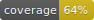

# Pandemia




Pandemia is an open source initiative to build a mobile app to fight against pandemia.

Pandemia proposes to assist citizens in their daily movements by monitoring the popularity of the places they visit.

Pandemia is actively developed by members of the [Spirals research group](https://team.inria.fr/spirals/), but external contributions are welcomed.

## Compile and run

Before running the application on your smartphone, you *MUST* follow "Environment variables"
instructions.

## Source code 

All this project's Dart code is located in the `lib` folder.

## Mockups 

An interactive mockup of the application can be found at `resources/mockup.pdf`.

## Environment variables

To inject API keys into the application, run `dart tool/env.dart` before launching the actual
application; this will generate a .env file containing all needed keys.

Without the `.env.generated` file, `pubspec.yaml` cannot be parsed correctly, preventing icons and
translations from being loaded and displayed.

## Run tests

```shell script
chmod +x ./tool/run_tests.sh
./tool/run_tests.sh
```